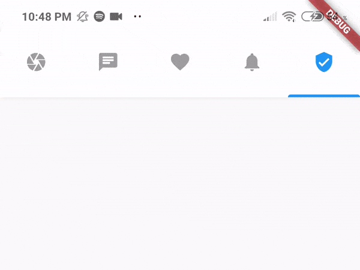
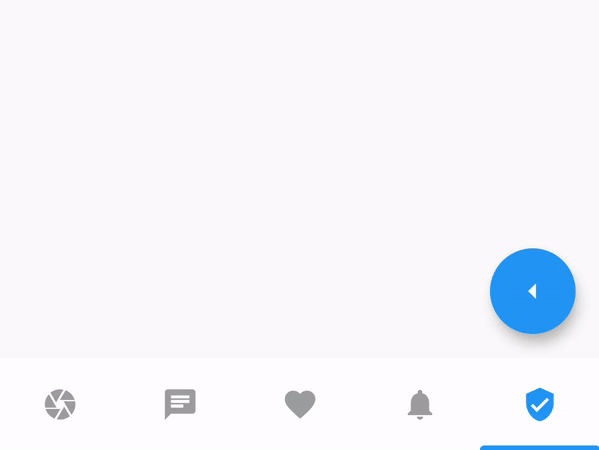
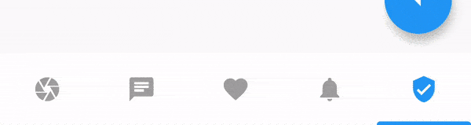
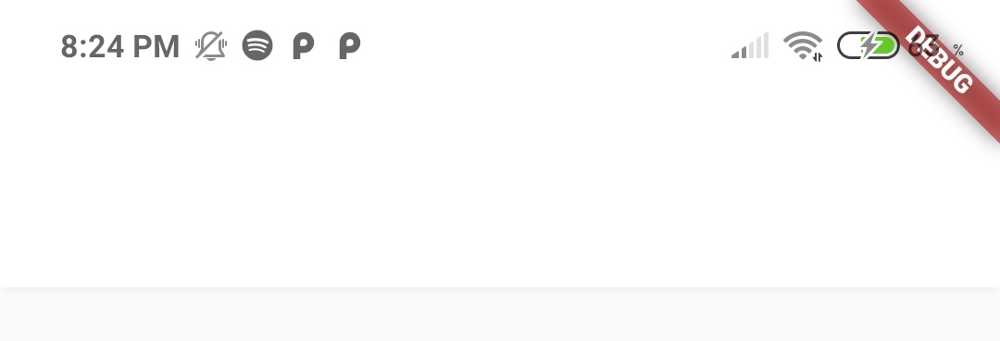
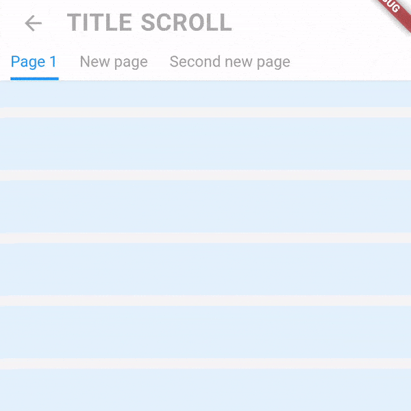
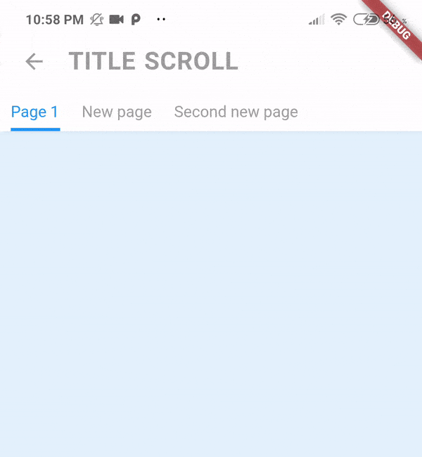

# scroll_navigation

## My other APIs

- [Video Viewer](https://pub.dev/packages/video_viewer)
- [Video Editor](https://pub.dev/packages/video_editor)
- [Helpers](https://pub.dev/packages/helpers)

<br>

## Features

- Fancy animations.
- Customizable colors.
- Works with the back button.
- Scrolling pages by gestures.
- Indicator that follows the scroll.
- Easy and powerful implementation! :)
- Page movement when tapping an icon.

---

<br>

## Implementation

```dart
return ScrollNavigation(
  pages: [
    Screen(title: title("Camera")),
    Screen(title: title("Messages"), backgroundColor: Colors.yellow[50]),
    Screen(title: title("Favor"), body: Container(color: Colors.cyan[50])),
    Screen(title: title("Activity"), backgroundColor: Colors.yellow[50]),
    Screen(title: title("Home"))
  ],
  navItems: const [
    ScrollNavigationItem(icon: Icon(Icons.camera)),
    ScrollNavigationItem(icon: Icon(Icons.chat)),
    ScrollNavigationItem(icon: Icon(Icons.favorite)),
    ScrollNavigationItem(icon: Icon(Icons.notifications)),
    ScrollNavigationItem(
      icon: Icon(Icons.home),
      activeIcon: Icon(Icon: verified_user),
    ),
  ],
  pagesActionButtons: [
    FloatingActionButton( //PAGE 1
      child: Icon(Icons.receipt),onPressed: () => null
    ),
    null,
    FloatingActionButton( //PAGE 3
      child: Icon(Icons.sync), onPressed: () => null,
    ),
    null,
    FloatingActionButton( //PAGE 5
      child: Icon(Icons.add), onPressed: () => print("Cool :)"),
    ),
  ],
);
```

<br><br>

---

<br><br>

## Scroll Navigation Details

(It's recommended to set showAppBar = false on the Screen Widget)

|        BarPosition: NavigationPosition.top        |        BarPosition: NavigationPosition.bottom        |
| :-----------------------------------------------: | :--------------------------------------------------: |
|  |  |

<br>

#### Go to a Page Code

```dart
final navigationKey = GlobalKey<ScrollNavigationState>();

@override
Widget build(BuildContext context) {
  return ScrollNavigation(
    key: navigationKey,
    pages: [...],
    navItems: [...],
    barStyle: NavigationBarStyle(position: NavigationPosition.top),
  );
}

void goToPage(int index) => navigationKey.currentState.goToPage(index);

```

<br><br>

---

<br><br>

## Identifier Details

|                       physics: true                        |                       physics: False                        |
| :--------------------------------------------------------: | :---------------------------------------------------------: |
|  |  |

<br><br>

|        IdentifierPosition: NavigationPosition.top        |                    showIdentifier: False                     |
| :------------------------------------------------------: | :----------------------------------------------------------: |
|  |  |

<br>

#### Code

```dart
return ScrollNavigation(
    pages: [...],
    items: [...],
    physics: true,
    showIdentifier: true,
    identiferStyle: NavigationIdentiferStyle(
      position: NavigationPosition.top,
    ),
);
```

<br><br>

---

<br><br>

## Screen Details

#### Screen fixes some problems the Scaffold has with the ScrollNavigation.

|                  Without Widgets                   |                  With Widgets                   |
| :------------------------------------------------: | :---------------------------------------------: |
|  |  |

<br>

#### Without Widgets Code

```dart
return Screen();
```

<br>

#### With Widgets Code

```dart
return Screen(
    title: title("Home"), //Function in the Example
    leftWidget: Icon(Icons.menu, color: Colors.grey),
    rightWidget: Icon(Icons.favorite, color: Colors.grey),
);
```

<br><br>

#### Hide AppBar on scroll.



<br>

#### Code

```dart
ScrollController controller = ScrollController();

return Screen(
    height: 56.0,
    elevation: 0.0,
    centerTitle: false,
    title: title("Title Scroll"),
    leftWidget: ScreenReturnButton(), //IMPORTANT TO RETURN!
    controllerToHideAppBar: controller,
    body: ListView.builder(
      itemCount: 15,
      controller: controller,
      itemBuilder: (context, key) {
        return Padding(
          padding: EdgeInsets.symmetric(vertical: 5),
          child: Container(
            height: 50,
            color: Colors.blue[50],
          ),
        );
      },
    ),
  );
```

<br><br>

---

<br><br>

## Title Scroll Navigation Details



<br>

#### Code

```dart
return TitleScrollNavigation(
    barStyle: TitleNavigationBarStyle(
      style: TextStyle(fontWeight: FontWeight.bold),
      padding: EdgeInsets.symmetric(horizontal: 40.0),
      spaceBetween: 40,
    ),
    titles: [
      "Main Page",
      "Personal Information",
      "Personalization",
      "Security",
      "Payment Methods",
    ],
    pages: [
      Container(color: Colors.blue[50]),
      Container(color: Colors.red[50]),
      Container(color: Colors.green[50]),
      Container(color: Colors.purple[50]),
      Container(color: Colors.yellow[50]),
    ],
);
```
