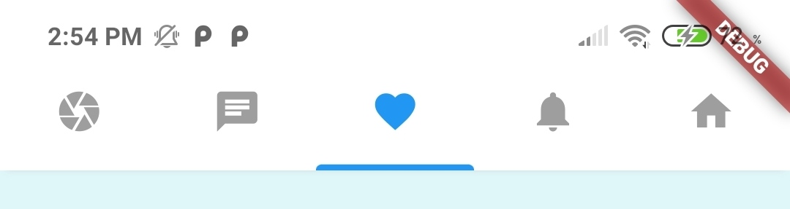
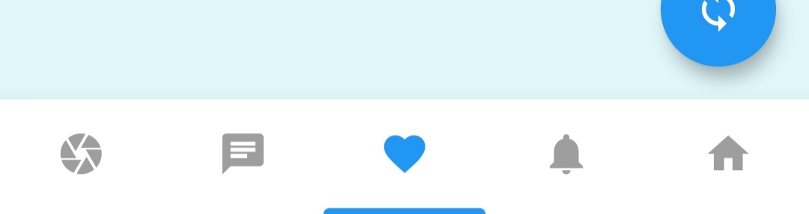
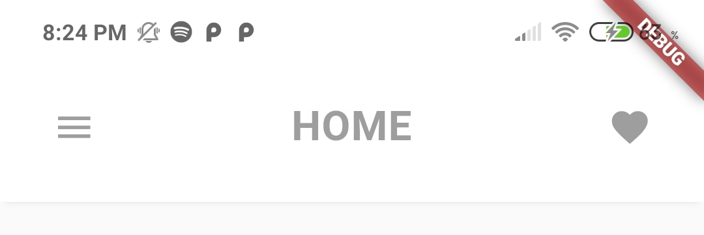

# scroll_navigation

## DEMO


<br><br>

---

## Features

- Scrolling pages by gestures.
- Page movement when tapping an icon.
- Indicator that follows the scroll.
- Works with the back button.
- Fancy animations on Floating Buttons.
- Customizable colors.
- Easy and powerful implementation! :)

---

<br>

## Implementation

```dart
return ScrollNavigation(
  //DEFAULT VALUES
  //initialPage = 0,
  //showIdentifier = true,
  //navigationOnTop = false,
  //showNavItemsTitle = false,
  //identifierPhysics = true,
  //identifierOnBottom = true,
  //activeColor = Colors.blue,
  //desactiveColor = Colors.grey,
  //backgroundColorNav = Colors.white,
  //backgroundColorBody = Colors.grey[100],
  pages: <Widget>[
    Screen(title: title("Camera")),
    Screen(title: title("Messages"), backgroundColor: Colors.red[50]),
    Screen(body: Container(color: Colors.cyan[50]), showAppBar: false),
    Screen(title: title("Activity"), backgroundColor: Colors.yellow[50]),
    Screen(title: title("Home")),
  ],
  navItems: <BottomNavigationBarItem>[
    BottomNavigationBarItem(icon: Icon(Icons.camera), title: Text(""));
    BottomNavigationBarItem(icon: Icon(Icons.chat), title: Text(""));
    BottomNavigationBarItem(icon: Icon(Icons.favorite), title: Text(""));
    BottomNavigationBarItem(icon: Icon(Icons.notifications), title: Text(""));
    BottomNavigationBarItem(icon: Icon(Icons.home), title: Text(""));
  ],
  pagesActionButtons: [
    FloatingActionButton( //PAGE 1
      child: Icon(Icons.receipt),onPressed: () => null
    ),
    null, //PAGE 2
    FloatingActionButton( //PAGE 3
      child: Icon(Icons.sync), onPressed: () => null,
    ),
    null, //PAGE 4
    FloatingActionButton( //PAGE 5
      child: Icon(Icons.add), onPressed: () => print("Cool :)"),
    ),
  ],
);
```

<br><br>

---

<br><br>

## Navigation Details

(It's recommended to set showAppBar = false on the Screen Widget)

|         navigationOnTop = True         |          navigationOnTop = False          |
| :------------------------------------: | :---------------------------------------: |
|  |  |

#### Code

```dart
return ScrollNavigation(
    navigationOnTop = true, //Default is false
    pages: <Widget>[],
    navItems: <BottomNavigationBarItem>[],
);
```

<br><br>

---

<br><br>

## Identifier Details

|           identifierPhysics = True            |           identifierPhysics = False            |
| :-------------------------------------------: | :--------------------------------------------: |
|  |  |

#### Code

```dart
return ScrollNavigation(
    identifierPhysics = false, //Default is true
    pages: <Widget>[],
    navItems: <BottomNavigationBarItem>[],
);
```

<br><br>

#### showIdentifier = False


#### Code

```dart
return ScrollNavigation(
    showIdentifier = false, //Default is true
    pages: <Widget>[],
    navItems: <BottomNavigationBarItem>[],
);
```

<br><br>

---

<br><br>

## Screen Details

#### Screen fixes some problems the Scaffold has with the ScrollNavigation.

|               Without Widgets               |               With Widgets               |
| :-----------------------------------------: | :--------------------------------------: |
|  |  |

#### Without Widgets Code

```dart
return Screen();
```

#### With Widgets Code

```dart
return Screen(
    title: title("Home"), //Function in the Example
    leftWidget: Icon(Icons.menu, color: Colors.grey),
    rightWidget: Icon(Icons.favorite, color: Colors.grey),
);
```

<br><br>

#### More details


#### Code

```dart
return Screen(
    leftWidget: ScreenReturnButton(), //IMPORTANT TO RETURN!
    title: title("New Home"),
    heightMultiplicator: 1,
    centerTitle: false,
);
```
