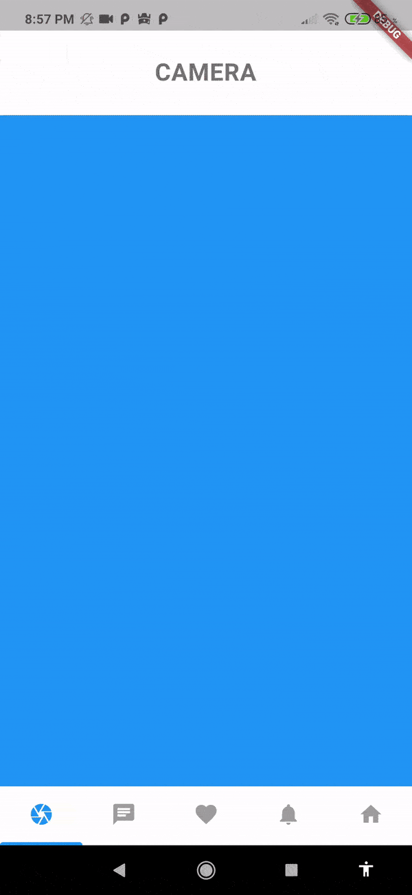
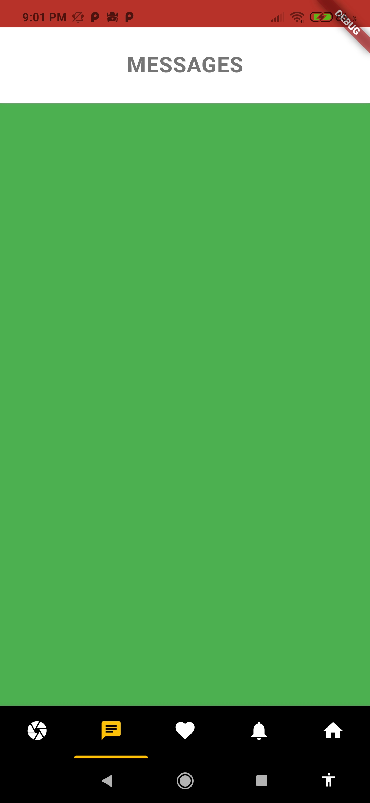
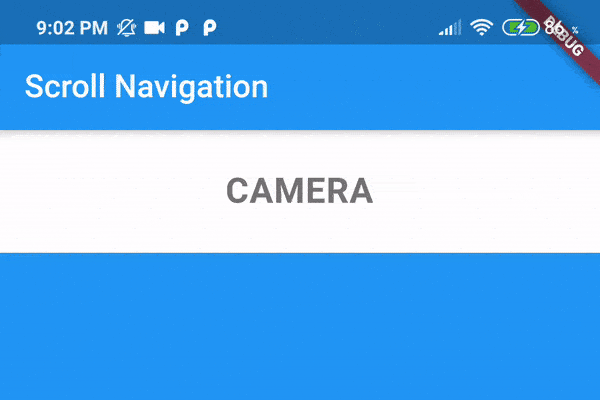

# scroll_navigation

## DEMO



<br><br>

---

## Features

- Scrolling pages by gestures.
- Page movement when tapping an icon.
- Indicator that follows the scroll.
- Works with the back button.
- Customizable colors.

---

<br>

## Implementation

```dart
return ScrollNavigation(
  //DEFAULT VALUES
  // initialPage = 0,
  // showIdentifier = true,
  // identifierPhysics = true,
  // activeColor = Colors.blue,
  // desactiveColor = Colors.grey,
  // backgroundColorBody = Colors.grey[100],
  // backgroundColorNav = Colors.white,
  // backgroundColorAppBar = Colors.white,
  // appBarBrightnessLight = false,
  pages: <Widget>[
    Container(color: Colors.blue),
    Container(color: Colors.green),
    Container(color: Colors.amber),
    Container(color: Colors.yellow),
    Container(color: Colors.lightBlue),
  ],
  navItems: <BottomNavigationBarItem>[
    BottomNavigationBarItem(icon: Icon(Icons.camera), title: Text(""));
    BottomNavigationBarItem(icon: Icon(Icons.chat), title: Text(""));
    BottomNavigationBarItem(icon: Icon(Icons.favorite), title: Text(""));
    BottomNavigationBarItem(icon: Icon(Icons.notifications), title: Text(""));
    BottomNavigationBarItem(icon: Icon(Icons.home), title: Text(""));
  ],
);
```

<br><br>

---

<br><br>

## Identifier Physics

#### Demo

|           identifierPhysics = True            |           identifierPhysics = False            |
| :-------------------------------------------: | :--------------------------------------------: |
|  |  |

#### Code

```dart
return ScrollNavigation(
    identifierPhysics = false, //Default is true
    pages: <Widget>[],
    navItems: <BottomNavigationBarItem>[],
);
```

<br><br>

---

<br><br>

## Customizable colors

#### Demo



#### Code

```dart
return ScrollNavigation(
    activeColor = Colors.amber,
    desactiveColor = Colors.white,
    backgroundColorNav = Colors.black,
    backgroundColorAppBar = Colors.red,
    pages: <Widget>[],
    navItems: <BottomNavigationBarItem>[],
);
```

<br><br>

---

<br><br>

## More details

|            Fixed AppBar            |           showIdentifier = False           |
| :--------------------------------: | :----------------------------------------: |
|  |  |

#### Fixed AppBar Code

```dart
return ScrollNavigation(
    appBar: AppBar(title: Text("Scroll Navigation")),
    pages: <Widget>[],
    navItems: <BottomNavigationBarItem>[],
);
```

#### Don't showIdentifier Code

```dart
return ScrollNavigation(
    showIdentifier = false,
    pages: <Widget>[],
    navItems: <BottomNavigationBarItem>[],
);
```
